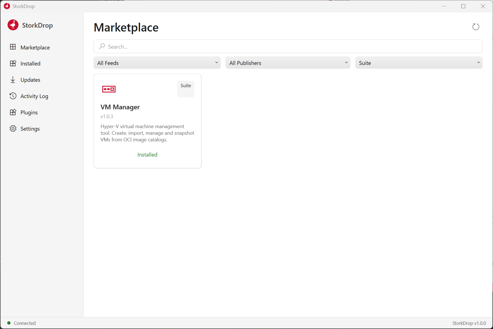

<p align="center">
  
  <br />
  <strong>StorkDrop</strong>
  <br />
  <em>Manifest-driven software deployment for servers and workstations</em>
</p>

---

<p align="center">
  
  <br />
  <em>The StorkDrop marketplace - browse, install, and update products from multiple feeds</em>
</p>

## What is StorkDrop?

StorkDrop is a self-contained deployment client that installs, updates, and manages software from Nexus OSS registries. Products declare their install behavior in a JSON manifest - no custom installer needed.

It's built for **server software and business tools** that:

- Need regular updates on production servers
- Require custom pre/post-install logic (database migrations, config writes, service restarts)
- Are deployed to multiple machines with slightly different configurations
- Don't justify building a full MSI/NSIS installer for each release

## When to use StorkDrop

| Scenario | StorkDrop | Traditional installer | Fleet management | Package manager |
|---|---|---|---|---|
| **Server-side business apps** | Built for this | Manual per-machine | Overkill | No custom logic |
| **Custom pre/post install logic** | Plugin system with dynamic UI | Baked into installer | Scripts only | Scripts only |
| **Multiple feeds/repositories** | Multi-feed with per-feed plugins | N/A | Multiple sources | Multiple sources |
| **Self-service marketplace** | Browse, search, filter | No discovery | Company portal | CLI search |
| **Version rollback** | Backup + restore | Manual | Complex | Limited |
| **Plugin extensibility** | Dynamic config UI, custom tabs | None | None | None |

## How it works

```
Nexus OSS          StorkDrop Client          Target Machine
(raw repo)    -->  Marketplace UI     -->    C:\Program Files\...
manifest.json      Plugin hooks              Shortcuts
product.zip        Install tracking          Environment variables
```

1. **Publish** your product to a Nexus raw repository with a `manifest.json`
2. **Users** open StorkDrop, browse the marketplace, click Install
3. **StorkDrop** downloads, extracts, runs plugin hooks, copies files, creates shortcuts
4. **Updates** are detected automatically and applied with backup/rollback
5. **Everything is tracked** - what was installed, where, and what changed - for clean uninstall

## Feature overview

### Marketplace

The marketplace shows all available products from all configured feeds. Users can:

- **Search** products by name, ID, or description
- **Filter** by feed, publisher, or product type (Suite, Plugin, Bundle)
- **Browse** product details with version history and release notes
- **Install** any version - not just the latest

When a product has a plugin connected to it, the install dialog shows a hint:
> "A plugin is connected to this product and may prompt for additional configuration during installation."

### Installation tracking

Installations run in the background. A status indicator in the bottom bar shows active installations - like a browser's download bar:

- Click it to see all active and completed installations
- Click any installation to open a **live log viewer** with a dark terminal-style UI
- Logs show every step: download, extract, plugin processing, file copy, shortcut creation
- Completed installations stay in the list with their full log history
- Supports native text selection and Ctrl+C for copying log output

**Example log output:**
```
[14:23:01] Installing Acme Dashboard v2.1.0 to C:\Program Files\Acme\Dashboard
[14:23:01] Downloading product acme-dashboard v2.1.0
[14:23:05] Download complete, extracting...
[14:23:06] Plugin found 2 file(s): update-original.sid, update-combined.sid
[14:23:06] Waiting for user configuration...
[14:23:12] Processing files with plugin...
[14:23:12] update-original.sid: Deployed SID to STEPS_Basis via Steps.Update
[14:23:12] update-combined.sid: Skipped (not selected)
[14:23:12] Plugin processing completed successfully
[14:23:13] Copying files to C:\Program Files\Acme\Dashboard
[14:23:14] Creating shortcuts...
[14:23:14] Registering product...
[14:23:14] Installation of Acme Dashboard v2.1.0 completed successfully
```

Toast notifications appear when installations complete or fail.

### Installation isolation

Every installation is isolated from every other installation and from the main application:

- **Per-product locking** - you cannot accidentally install the same product twice at the same time. If you try, StorkDrop immediately tells you "Another installation of X is already in progress" instead of silently corrupting files.
- **Independent cancellation** - each installation has its own cancellation token. Cancelling one install does not affect others.
- **Exception containment** - if an installation fails with an unexpected error, it is caught, logged, and reported as a failed result. Other running installations continue unaffected. The main application never crashes due to an install failure.
- **Environment variable serialization** - if two products both need to modify the `PATH` variable, the operations are serialized so one doesn't overwrite the other's changes.
- **Elevated process isolation** - when admin privileges are needed, a separate process handles the privileged operation. It has its own DI container, its own service instances, and its own error handling. The main application is never affected by what happens in the elevated process.

**What this means in practice:**

You can install Product A and Product B at the same time. If Product A's database migration fails halfway through, Product A's backup is restored and it reports failure - but Product B continues installing normally, completely unaware that anything went wrong with Product A.

### Reliability and safety

StorkDrop is designed for production servers where failed updates are not acceptable.

**Backup and rollback:**
Before updating a product, StorkDrop creates a ZIP backup of the entire installation directory. If anything goes wrong during the update - download failure, extraction error, plugin crash, file copy issue - the backup is automatically restored and the product is left in its previous working state. The user sees a clear error message; the product continues working.

**File manifest tracking:**
Every file that StorkDrop installs is recorded in a manifest (`{productId}.files.json`). When you uninstall, only those exact files are removed - nothing more, nothing less. If you manually added files to the installation directory, they are left untouched. If the manifest is missing (e.g., from a very old install), StorkDrop falls back to removing the entire directory, but warns first.

**Plugin failure handling:**
If a plugin's file handler (e.g., a SID file deployer) reports failure, the entire installation is aborted immediately. StorkDrop does not continue copying files or creating shortcuts for a product whose custom deployment step failed. The error is logged, a toast notification is shown, and the user can review the full log.

**Atomic configuration writes:**
All configuration files (product registry, settings, activity log) are written to a temporary file first, then atomically moved into place. If StorkDrop crashes mid-write, the previous valid file is still intact.

**Retry with backoff:**
File deletions during uninstall and update retry up to 3 times with 500ms delays. This handles transient locks from antivirus scanners, Windows Search indexer, and other processes that briefly hold file handles.

**Environment variable rollback:**
When a product sets `ACME_HOME` or appends to `PATH`, the exact change is recorded in a tracking file. On uninstall, only that specific change is reversed. For `PATH`, only the appended segment is removed - all other entries are preserved.

### File-in-use handling

When an update needs to replace a running executable:

1. The locked file is renamed to `DEL_{guid}_{filename}` in the same directory
2. The new version is copied into place with the original filename
3. The renamed old file is scheduled for deletion on next reboot (via Windows `MoveFileEx` API)
4. The application runs the new version immediately; the old file is cleaned up on restart

### UAC elevation

StorkDrop runs as a normal user. When the install path requires admin privileges (Program Files, Windows directory):

1. The install dialog detects the protected path and shows a warning
2. A separate elevated process is spawned via the Windows `runas` verb (UAC prompt)
3. The elevated process performs only the install/update/uninstall operation, then exits
4. The main process reloads state from disk to see the changes
5. The feed ID is passed to the elevated process so it downloads from the correct repository

For uninstall, if the product was installed to a protected directory, the confirmation dialog includes a note that admin privileges will be required.

### File lock detection

Before uninstalling or updating, StorkDrop checks `.exe` and `.dll` files for locks:

- Uses the Windows Restart Manager API (`rstrtmgr.dll`) to identify which process holds the lock
- Only checks executable files to avoid false positives from the Windows indexer or antivirus
- Uses `FileShare.ReadWrite | FileShare.Delete` - the minimum access needed to determine if deletion is possible
- Shows a clear error: "Cannot uninstall: file 'MyApp.exe' is locked by: MyApp"

### Data protection

- Feed passwords are encrypted with DPAPI (`ProtectedData` with `CurrentUser` scope) - they're tied to the current Windows user and machine
- Configuration files use atomic writes (temp file + move) to prevent corruption
- The product registry validates for duplicate entries on load

## Multi-feed support

StorkDrop connects to multiple Nexus repositories simultaneously. Products from all feeds appear in a unified marketplace.

```json
{
  "feeds": [
    { "id": "internal", "name": "Internal Feed", "url": "https://nexus.company.com", "repository": "releases" },
    { "id": "vendor", "name": "Vendor Feed", "url": "https://feed.vendor.com:8443", "repository": "tools" }
  ]
}
```

- Each feed gets its own HTTP client with independent credentials
- Products are tagged with their source feed throughout the entire lifecycle
- The feed filter dropdown appears when 2+ feeds are configured
- Installed products remember their source feed, so updates check the right repository
- Elevated processes receive the feed ID as a command-line argument

### Adding a new feed type

All feed interactions go through the `IRegistryClient` interface. To add a non-Nexus backend (GitHub Releases, S3, Azure Artifacts):

1. Implement `IRegistryClient` for your backend
2. Extend `FeedRegistry` to create your client type based on a field in `FeedConfiguration`
3. The marketplace, engine, updates, and all UI features work automatically

## Product manifest

Products are stored in Nexus raw repositories:

```
my-product/
  manifest.json                    Latest version manifest
  versions/1.0.0/
    manifest.json                  Version-specific manifest
    my-product-1.0.0.zip           Product artifact
```

```jsonc
{
  "productId": "my-product",
  "title": "My Product",
  "version": "1.0.0",
  "releaseDate": "2026-03-24",
  "installType": "Suite",                        // Plugin | Suite | Bundle
  "description": "Short description for the marketplace card",
  "releaseNotes": "# What's new\n- Feature A\n- Bug fix B",
  "recommendedInstallPath": "C:\\Program Files\\MyCompany\\MyProduct",
  "publisher": "My Company",
  "imageUrl": "https://example.com/icon.png",
  "downloadSizeBytes": 52428800,
  "requirements": ["Windows 10+", ".NET 8 Runtime"],
  "shortcuts": [
    { "exeName": "MyProduct.exe", "displayName": "My Product" },
    { "exeName": "MyAdmin.exe", "displayName": "My Product Admin", "iconPath": "admin.ico" }
  ],
  "shortcutFolder": "My Company",
  "environmentVariables": [
    { "name": "MY_PRODUCT_HOME", "value": "{InstallPath}", "action": "set" },
    { "name": "PATH", "value": "{InstallPath}\\bin", "action": "append", "mustExist": true }
  ],
  "plugins": [
    { "assembly": "MyProduct.dll", "typeName": "MyProduct.Installer" }
  ],
  "cleanup": {
    "registryKeys": [],
    "dataLocations": ["%APPDATA%\\MyProduct"]
  }
}
```

## Plugin system

### App-level plugins (`IStorkDropPlugin`)

Drop a DLL in the `plugins/` directory next to StorkDrop. It's discovered and loaded automatically at startup. Plugins can:

- Add sidebar navigation tabs with custom configuration pages
- Claim file types from product packages (e.g., `.sid`, `.sql`) for custom deployment
- Show setup wizard steps during first-run configuration
- Add sections to the Settings page
- React to product install/uninstall events

```csharp
public class MyPlugin : IStorkDropPlugin, IFileTypeHandler
{
    public string PluginId => "my-plugin";
    public string DisplayName => "My Plugin";
    public string[] AssociatedFeeds => new[] { "https://nexus.example.com" };

    public IReadOnlyList<string> HandledExtensions => new[] { ".sql" };

    // Called after extraction - return config fields the user must fill in
    public IReadOnlyList<PluginConfigField> GetFileHandlerConfig(
        IReadOnlyList<string> files, PluginContext context)
    {
        return new[] {
            new PluginConfigField {
                Key = "target-db",
                Label = "Target Database",
                FieldType = PluginFieldType.Dropdown,
                Required = true,
                Options = { new PluginOptionItem { Value = "prod", Label = "Production DB" } }
            }
        };
    }

    // Called after user fills in the config - deploy the files
    public async Task<FileHandlerResult> HandleFilesAsync(
        IReadOnlyList<string> files, PluginContext context, CancellationToken ct)
    {
        // If this returns Success = false, the entire installation is aborted
        // ...
    }
}
```

**Plugin loading and version compatibility:**
Plugins reference `StorkDrop.Contracts` via NuGet. At runtime, StorkDrop's plugin loader uses a custom `AssemblyLoadContext` that resolves shared assemblies (like `StorkDrop.Contracts`) from the host application. This means a plugin built against Contracts v1.0.7 works with a StorkDrop built against v1.0.8 - the types are the same, just different version stamps.

**Debug support:**
Use `--plugin-dir C:\path\to\build\output` to load plugins from a development directory. In Rider/VS, configure the launch profile to start StorkDrop with this argument pointing to your plugin's `bin/Debug` folder. Set breakpoints in the plugin code and debug directly.

### Product-level plugins (`IStorkPlugin`)

Products ship a DLL with pre/post install logic and dynamic configuration UI:

```csharp
public class MyInstaller : IStorkPlugin
{
    public IReadOnlyList<PluginConfigField> GetConfigurationSchema(PluginEnvironment env)
    {
        // Return fields - StorkDrop renders them as a form before installation
        return new[] {
            new PluginConfigField { Key = "db", Label = "Database", FieldType = PluginFieldType.Dropdown, Required = true }
        };
    }

    public async Task<PluginPreInstallResult> PreInstallAsync(PluginContext ctx, CancellationToken ct)
    {
        // Validate config, check prerequisites - return Success = false to abort
    }

    public async Task PostInstallAsync(PluginContext ctx, CancellationToken ct)
    {
        // Write config files, run migrations, register services
    }
}
```

### Configuration field types

| Type | Control | Use case |
|---|---|---|
| `Text` | TextBox | Free text input |
| `Number` | Validated TextBox | Numeric with optional min/max |
| `Dropdown` | ComboBox | Single selection from options |
| `MultiSelect` | Checkbox list | Multiple selections |
| `Checkbox` | CheckBox | Boolean toggle |
| `Password` | PasswordBox | Sensitive input (masked) |
| `FilePath` | TextBox + browse | File selection |
| `FolderPath` | TextBox + browse | Directory selection |

## Environment variables

Products declare environment variables in the manifest. Changes are tracked per-product and precisely reversed on uninstall.

| Action | On install | On uninstall |
|---|---|---|
| `set` | Creates or overwrites the variable | Deletes it entirely |
| `append` | Appends a value with separator | Removes only the appended portion |

The `mustExist` flag (for `append`) controls what happens when the target variable doesn't exist: if `true`, the append is silently skipped; if `false` (default), the variable is created.

Concurrent environment variable modifications from parallel installations are serialized to prevent race conditions where two products both append to `PATH` and one overwrites the other.

## Logging

StorkDrop logs every operation with structured logging via Serilog:

- **Installation steps** - download, extract, plugin processing, file copy, shortcuts, env vars, registration
- **Feed operations** - which feeds are loaded, how many products found, connection test results
- **Plugin loading** - which DLLs were discovered, which types were found, which failed and why
- **Update checking** - which feeds were queried, what updates were found
- **Configuration changes** - settings saves, imports, exports

Log files are stored in `%APPDATA%/StorkDrop/Logs/` with daily rolling and 30-day retention.

The Activity Log page has a "View Application Logs" button that opens the log directory. The installation panel's log viewer shows real-time per-installation logs.

## NuGet package

```xml
<PackageReference Include="StorkDrop.Contracts" />
```

## Architecture

```
StorkDrop.sln
dotnet/
  StorkDrop.Contracts/     Models, interfaces, plugin contracts (NuGet, net10.0)
  StorkDrop.Registry/      Nexus client, FeedRegistry (net10.0)
  StorkDrop.Installer/     Install engine, coordinator (net10.0-windows)
  StorkDrop.App/           WPF application (net10.0-windows, win-x64)
  StorkDrop.Tests/         Unit tests (net10.0-windows)
```

## Building

```bash
dotnet build StorkDrop.sln --configuration Release
dotnet test StorkDrop.sln --configuration Release
```

## Configuration

Stored in `%APPDATA%/StorkDrop/Config/`:

| File | Purpose |
|---|---|
| `config.json` | Feeds, preferences, language |
| `installed-products.json` | Installed product registry |
| `activity-log.json` | Installation activity log |
| `{productId}.files.json` | Per-product file manifest (for clean uninstall) |
| `{productId}.envvars.json` | Per-product environment variable tracking |
| `plugin-config-{productId}.json` | Plugin config values (remembered between updates) |

Logs in `%APPDATA%/StorkDrop/Logs/` (Serilog, rolling daily, 30-day retention).

## Roadmap

- **Cross-platform plugin scripting** - support pre/post install scripts in PowerShell, Python, and Bash alongside compiled .NET plugins
- **Differential updates** - download only changed files using binary diff instead of full packages
- **Rollback history** - keep multiple backup versions with a UI to restore any previous state
- **Remote management API** - REST API for triggering installs and checking status across a fleet of machines
- **Dependency resolution** - declare dependencies between products and install them in the correct order
- **Signed manifests** - GPG/Authenticode signing for manifests and packages with verification on install
- **Linux support** - extend beyond Windows with systemd service management and package integration
- **Additional languages** - expand localization beyond English and German

## License

MIT
